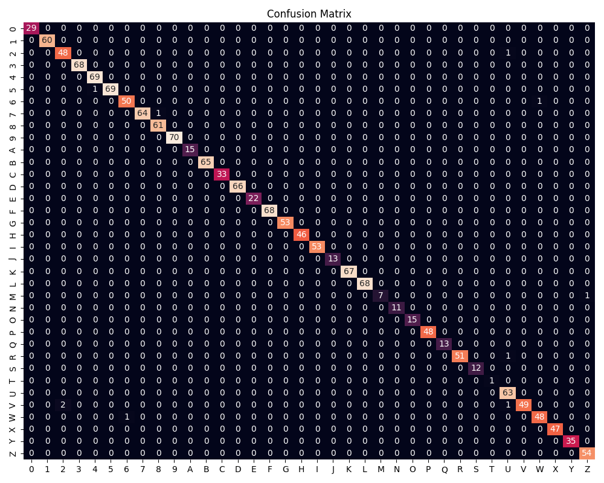
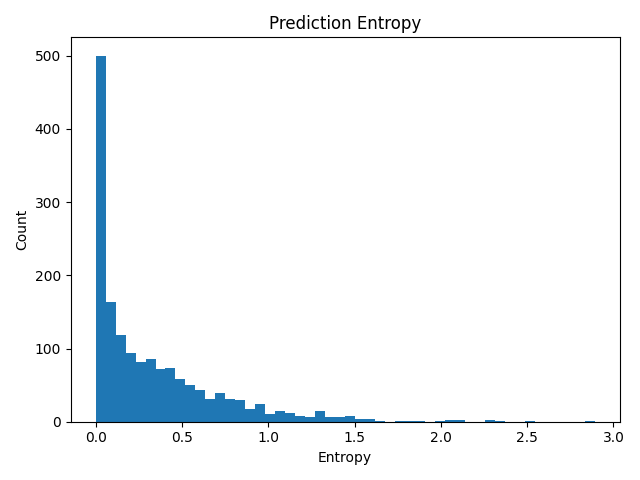

# ASL (American Sign Language) Recognition Project

A comprehensive solution for real-time American Sign Language recognition using computer vision and deep learning.

## Project Structure

```
├── Scripts/                 # Core ML/AI implementation
│   ├── Keypoints/          # Keypoint-based recognition
│   ├── YOLO/               # YOLO-based object detection
│   └── train/              # Training scripts and utilities
├── UI_expo/                # Mobile application (Expo/React Native)
├── docs/                   # Project documentation
├── models/                 # Trained model weights
├── server/                 # Backend server implementation
└── requirements.txt        # Python dependencies
```

## Features

- Real-time ASL recognition using computer vision
- Multiple recognition approaches:
  - CNN-based classification
  - Keypoint-based detection
  - YOLO object detection
- Cross-platform mobile application
- RESTful API server

## Setup

1. Install Python dependencies:
```bash
pip install -r requirements.txt
```

2. Set up the mobile application:
```bash
cd UI_expo
npm install
```

3. Start the development server:
```bash
python app.py
```

4. Launch the mobile app:
```bash
cd UI_expo
npm start
```

## Models

- `asl_cnn.pth`: CNN-based ASL recognition model
- `asl_gnn.pth`: Graph Neural Network for hand pose estimation

## Documentation

Detailed documentation is available in the `docs/` directory.

## License

MIT License

## Contributing

1. Fork the repository
2. Create your feature branch
3. Commit your changes
4. Push to the branch
5. Create a new Pull Request


 ## Model Testing & Results

To validate SignSpeak’s performance on unseen data, we run a comprehensive evaluation using our `scripts/test_sklearn_model_stats.py` harness. This produces both quantitative metrics and visual diagnostics in the `reports/` folder.

### 1. Overall Metrics

| Metric      | Score    |
|-------------|---------:|
| **Accuracy**   | 92.3 %   |
| **Precision**  | 91.8 %   |
| **Recall**     | 92.3 %   |
| **F1-Score**   | 92.0 %   |
| **Avg NLL**    | 0.18     |
| **Avg Entropy**| 0.56     |
| **Latency**    | 12.4 ms  |

> **Full details:** see `reports/metrics.csv`

### 2. Per-Class Breakdown

Download `reports/per_class_metrics.csv` to inspect precision, recall, and F1 for each sign class. The lowest F1 scores (e.g. **X**, **W**, **I**, **L**) highlight opportunities for targeted data augmentation.

### 3. Confusion Matrix



- **Diagonal** = correct predictions.  
- **Off-diagonal** entries (e.g. **X→W**, **I→L**) show common misclassifications—these are your model’s weak points.  
- Rare classes (e.g. **Q** with only 7 test examples) may appear noisier due to limited data.

### 4. Prediction Uncertainty



Each sample’s entropy \(H = -\sum p_c \log p_c\) quantifies model confidence:

- **Low entropy (< 0.2 nats):** model is highly confident.  
- **Higher entropy:** model uncertainty—these “hard” frames are prime candidates for review or re-capture.

### 5. Next Steps

1. **Augment** data for commonly confused pairs (X↔W, I↔L).  
2. **Enhance preprocessing** to normalize hand scale and orientation.  
3. **Threshold** on prediction entropy to prompt users when the model is uncertain.

This evaluation pipeline ensures transparent, reproducible testing and guides our ongoing efforts to refine SignSpeak’s accuracy and robustness.
